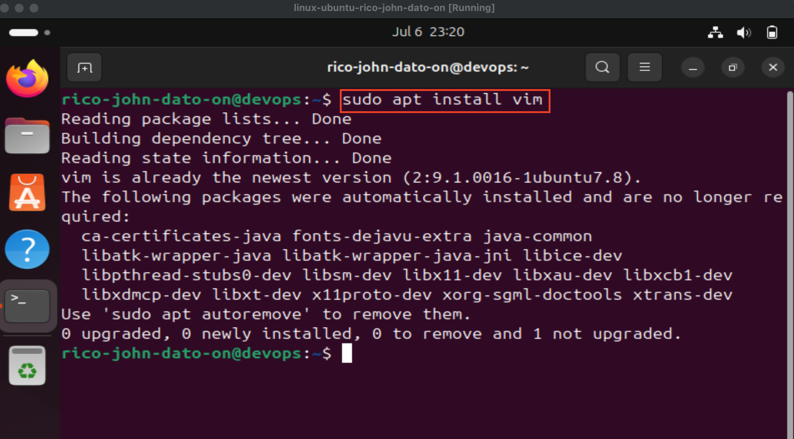
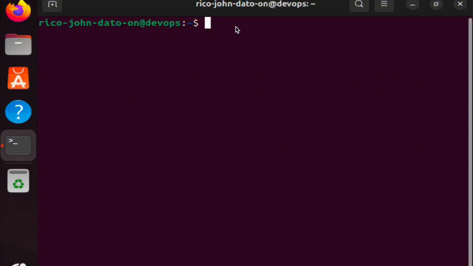
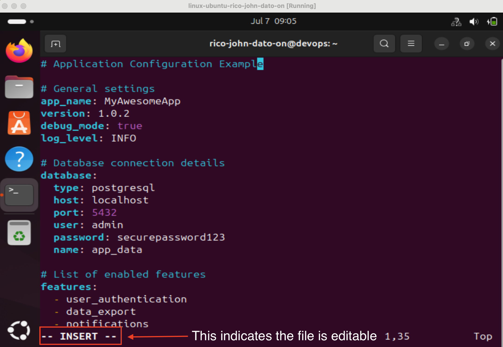
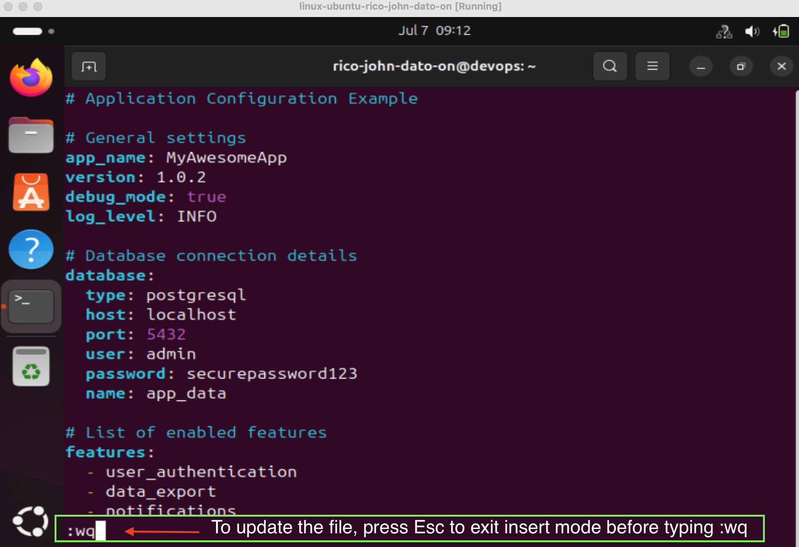
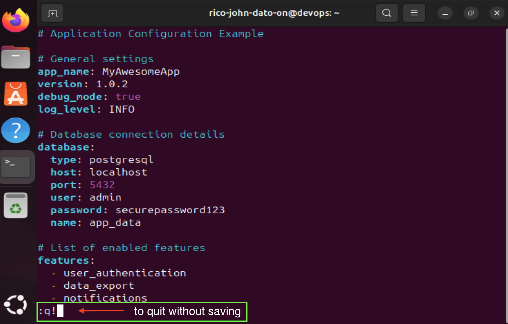

# 📝 Working with Vim Editor on Linux

Vim is a powerful text editor used in the command-line interface. It allows you to create, modify, and navigate files quickly and efficiently. It's an essential skill for any Linux user, system admin, or DevOps engineer.

---

## 🧠 Why Learn Vim?

- Quick edits to config files
- Available on all Unix/Linux systems (even remote servers)
- Faster than using a GUI for small changes
- Helpful when committing via Git, or editing in a container

---

## 📦 Installing Vim

```bash
sudo apt install vim
```



---

## 🚪 Opening a File



- Open an existing file:
  ```bash
  vim filename.txt
  ```
- Create and open a new file:
  ```bash
  vim config.yaml
  ```

---

## 🧭 Vim Modes

- **Command Mode**: Default when opening Vim (navigate, delete, search)
- **Insert Mode**: Used for typing/editing text
  - Switch with `i` (insert)
- **Back to Command Mode**: Press `Esc`



---

## 💾 Save and Exit

- Save and quit: `:wq`

  

- Quit without saving: `:q!`

  

---

## ✏️ Basic Editing

| Action                      | Command     |
| --------------------------- | ----------- |
| Insert mode                 | `i` or `a`  |
| Delete current line         | `dd`        |
| Delete 10 lines             | `10dd`      |
| Undo                        | `u`         |
| Redo                        | `Ctrl + r`  |
| Go to end of line           | `Shift + A` |
| Go to start of line         | `0`         |
| Go to end of line (command) | `$`         |
| Jump to line 12             | `12G`       |

---

## 🔎 Search and Replace

### Search for a word

```bash
/nginx
```

- Next match: `n`
- Previous match: `Shift + N`

### Replace all instances

```bash
:%s/nginx/webapp/g
```

---

## 🧠 Tips

- Use Vim to write commit messages
- Use it to edit remote config files via SSH
- Practice on files you don't mind changing!

---

🧑‍💻 Created by Rico John Dato-on
